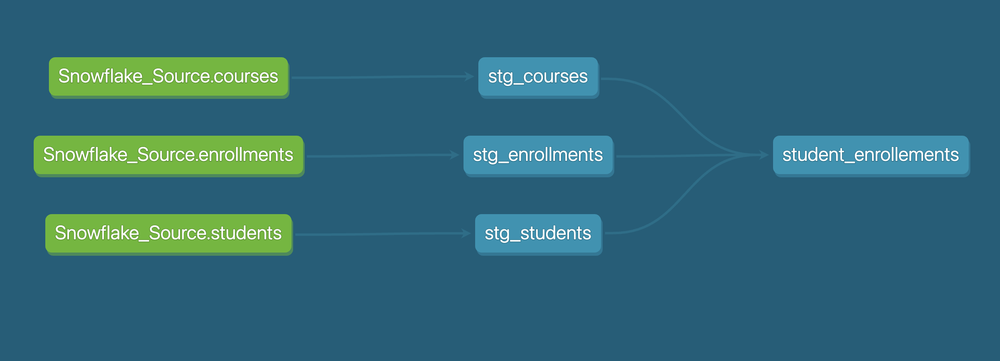
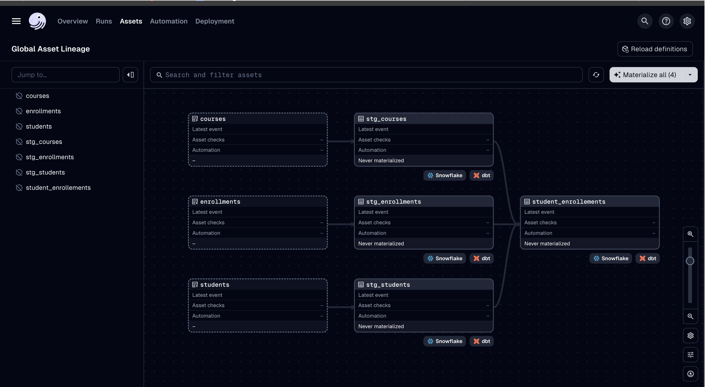
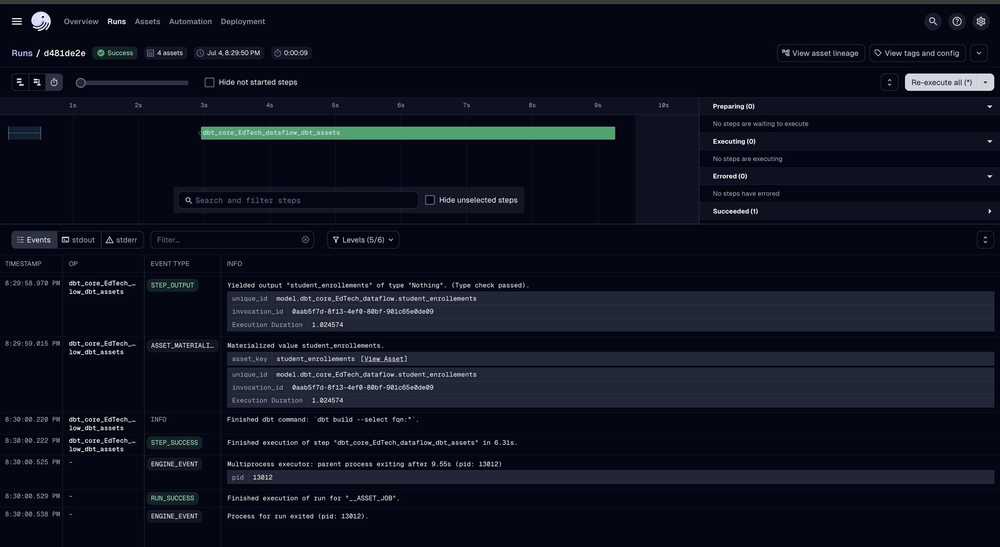
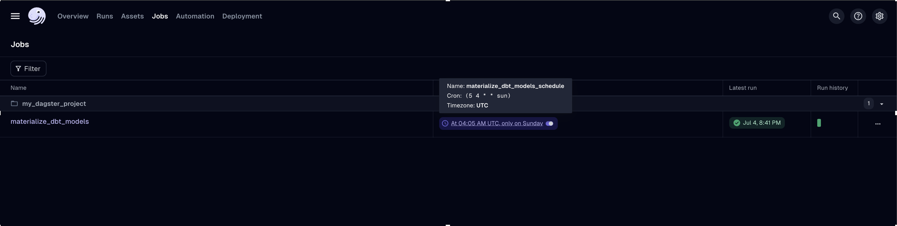

# EdTech DataFlow: Modern ELT Pipeline with Snowflake, dbt, and Dagster

A comprehensive modernization of ELT (Extract, Load, Transform) pipelines for a leading edtech platform.  
This project demonstrates **data modeling, transformation, automation, and orchestration**—showcasing best practices in both dbt Cloud and dbt Core environments.

---

## 🚩 Project Goal

To **modernize data transformation and management** practices for an EdTech platform, enabling:

- Robust, automated data pipelines
- CI/CD best practices for analytics engineering
- Clear, maintainable data models and lineage
- Secure management of credentials and environments

---

## 🗺️ Problem Statement & Requirements

We needed to:

- Set up scalable, maintainable data pipelines built on **Snowflake**.
- Use **dbt** for modular, documented data transformations.
- Automate the entire workflow, with scheduling and monitoring.
- Ensure that all engineering best practices (testing, documentation, version control, orchestration) were followed.

**Business/Data Questions:**

> These business/data questions formed the **POC** use cases for this project, which are fully addressed by the dbt models in the repo.

### **Students Table**

- Calculate age of students
- Extract year of enrollment
- Create full name
- Flag adult students
- Days since enrollment
- Enrollments per course, per month (pivot)
- Total credits enrolled per student (pivot)
- Running total of enrollments per student

### **Courses Table**

- Course level (Beginner/Intermediate/Advanced)
- Is the course active?
- Days remaining until course start
- Status of course (Ended/Ongoing/Yet to Start)

---

## 🏗️ Solution Architecture & Tech Stack

| Layer              | Tool(s)       | Purpose                                               |
| ------------------ | ------------- | ----------------------------------------------------- |
| **Data Warehouse** | **Snowflake** | Centralized, scalable cloud data storage              |
| **Transformation** | **dbt**       | Data modeling, transformation, testing, documentation |
| **Orchestration**  | **Dagster**   | Workflow scheduling, orchestration for dbt Core       |
| **Automation**     | dbt Cloud     | Built-in scheduling and monitoring (for dbt Cloud)    |
| **Scheduling**     | Dagster/Cron  | Custom scheduling for dbt Core jobs                   |
| **Languages**      | Python, SQL   | Data orchestration and transformation                 |

---

## 📦 Project Structure

EdTech_DataFlow/
│
├── analyses/ # SQL or BI analysis scripts
├── Dataset/ # Raw data (CSV files)
│
├── DBT-Core-EdTech-Orch/ # Orchestration & pipeline code (Dagster + dbt)
│ └── dbt_core_EdTech_dataflow/
│ ├── analyses/ # dbt analysis files
│ ├── logs/ # (ignored) Log files
│ ├── macros/ # dbt macros
│ ├── models/ # dbt models (SQL transformations)
│ ├── seeds/ # dbt seed data (small CSVs)
│ ├── snapshots/ # dbt snapshot definitions
│ ├── target/ # (ignored) dbt build output
│ ├── tests/ # dbt test definitions
│ ├── profiles.yml # dbt credentials (not committed)
│ ├── dbt_project.yml # dbt project config
│ ├── README.md # Project documentation
│ ├── my_dagster_project/# Dagster orchestration code (Python)
│ └── venv/ # (ignored) Python virtual environment

\*Note:

- Outer folders contain analysis scripts and raw data.
- All pipeline logic and orchestration lives in the dbt_core_EdTech_dataflow directory.\*

---

## 🧠 Step 1: Data Modeling & Transformation (on Snowflake + dbt)

All raw data is ingested and stored in **Snowflake** tables:

- students
- enrollments
- courses

We use **dbt** to build a modular, layered transformation pipeline:

- **Staging layer:** Raw-to-clean transformations
- **Mart layer:** Final business tables and calculated fields (e.g., age, status, pivots)

Every requirement/question was addressed via specific dbt models, using Jinja and SQL logic

---

## 📈 dbt Cloud Lineage Graph

Visual lineage of your dbt models as seen in dbt Cloud:



--

## ⚡ Step 2: Automation in dbt Cloud

- **dbt Cloud** provides a simple, managed interface for running and scheduling dbt jobs.
- We automated the pipeline runs directly in dbt Cloud—leveraging built-in job scheduling, lineage, and documentation features.
- CI/CD practices (including version control and environment separation) were enabled through the dbt Cloud UI.

---

## 🤖 Step 3: Orchestration with Dagster + dbt Core

While dbt Cloud offers its own orchestration, **dbt Core** (the open-source version) does NOT.

- To demonstrate end-to-end workflow orchestration, we migrated the project to **dbt Core**.
- **Dagster** was used as the orchestration tool, integrating with dbt Core to:
  - Run dbt models as jobs/pipelines
  - Schedule and monitor runs (e.g., using cron for “At 04:05 on Sunday”)
  - Provide pipeline lineage and run logs via the Dagster UI

This setup showcases how any open-source orchestration tool can work with dbt Core to achieve fully automated, production-grade data workflows.

---

## 📈 Lineage Graph

See the lineage of dbt models in the Dagster UI:



---

## ✅ Successful Dagster Run

Example screenshot of a successful Dagster job run:



---

## ⏰ Scheduling: Cron Job Setup in Dagster

**Sample Dagster schedule code:**
[View full code here](./DBT-Core-EdTech-Orch/my_dagster_project/my_dagster_project/schedules.py)

```python
from dagster_dbt import build_schedule_from_db_selection

from .assets import dbt_core_EdTech_dataflow_dbt_assets

schedules = [
    build_schedule_from_dbt_selection(
        [dbt_core_EdTech_dataflow_dbt_assets],
        job_name="materialize_dbt_models",
        cron_schedule="5 4 * * sun",
        dbt_select="fqn:*",
    ),
]
```

---

## 🗓️ Cron Job Appearing in Dagster UI

Screenshot of the cron job as seen in the Dagster Jobs UI:



---

## 🔍 Key Features

- **Snowflake** as central data warehouse
- Modular, tested data modeling in **dbt**
- End-to-end automation in **dbt Cloud** and **dbt Core** (+ Dagster)
- Orchestration, scheduling, and pipeline monitoring via **Dagster**
- Secure management of secrets and credentials
- Full CI/CD compatibility, ready for production

---

## 🛠️ Tech Stack

- **Snowflake** (Data warehouse)
- **dbt Cloud** (Managed transformation, orchestration)
- **dbt Core** (Open-source transformation, for custom orchestration)
- **Dagster** (Workflow orchestration)
- **Python** (ETL/orchestration scripting)
- **SQL** (dbt models and transformations)

---

## 🤝 Contributions

Contributions, issues, and feature requests are welcome!  
Open a pull request or submit an issue for feedback.
